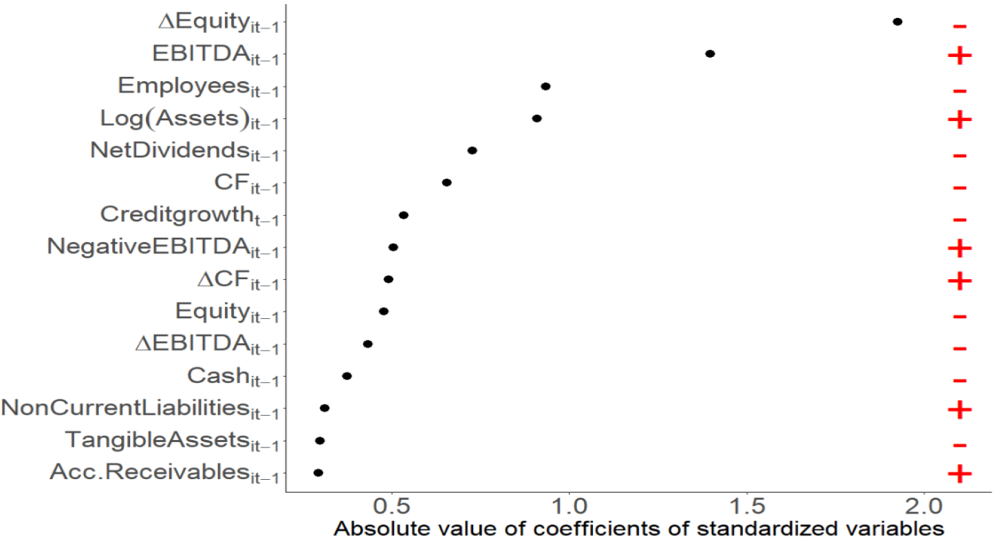

---
# -------------------------------------------------------
# REQUIRED FIELDS
# -------------------------------------------------------

title: "My First Post"
date: 2026-02-27
description: "A short description of what this post is about. This text appears in the blog listing."

# -------------------------------------------------------
# OPTIONAL FIELDS
# -------------------------------------------------------

categories:
  - Economics
  - Research

# Thumbnail shown next to the title in the blog listing.
# Place the image file in this folder (blog/first-post/) and set its name here.
# Remove this line if you don't want a thumbnail.
image: cover.png

# Set to true to hide this post while drafting. Remove when ready to publish.
# draft: true

# -------------------------------------------------------
# PAGE SETTINGS
# -------------------------------------------------------
author: "Martin Farias"
page-layout: article
title-block-banner: true
---

Write your post content here using standard Markdown.

## Figures

To add a figure, place the image file in this post's folder and reference it:

For a smaller or centered figure, you can control the width:

{width=60% fig-align="center"}

You can also give figures a label to cross-reference them in the text
(e.g. "as shown in @fig-example"):

{#fig-example width=60%}

## Tables

Standard Markdown tables:

| Country | GDP growth | Inflation |
|---------|:----------:|----------:|
| Spain   | 2.5%       | 3.1%      |
| Germany | 0.2%       | 2.8%      |
| France  | 1.1%       | 2.4%      |

: A caption for the table. {tbl-colwidths="[40,30,30]"}

You can also reference tables with a label (e.g. "as in @tbl-example"):

| A   | B   |
|-----|-----|
| 1   | 2   |

: Table caption. {#tbl-example}

## Equations

Inline: $y = \beta_0 + \beta_1 x$

Displayed:

$$
\hat{\beta} = (X'X)^{-1}X'y
$$ {#eq-ols}

---

**To write a new post:** duplicate the `blog/first-post/` folder, rename it
(e.g. `blog/my-new-post/`), and edit `index.qmd` inside it.
