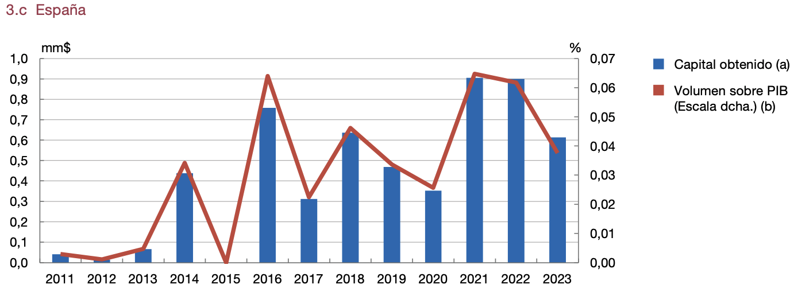
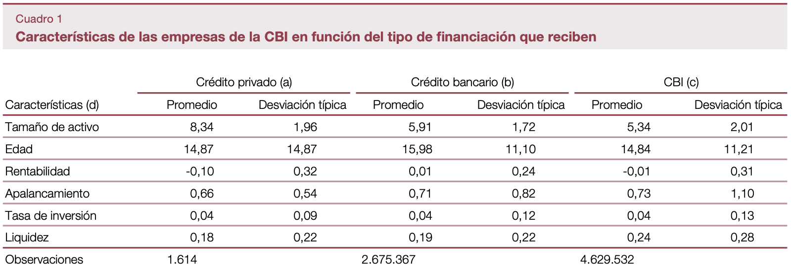

## Abstract

El mercado de crédito privado ha experimentado un crecimiento notable en los últimos años, posicionándose como una alternativa a la financiación bancaria tradicional. Aunque aún representa una fracción pequeña del crédito corporativo total, especialmente en España, su evolución refleja una creciente sofisticación y diversificación, lo que ha despertado el interés de los supervisores por llevar a cabo una monitorización más rigurosa para preservar la estabilidad del sistema financiero. En España, las empresas que recurren al crédito privado son mayoritariamente de los sectores de tecnología, comunicaciones, industria y comercio. Además, suelen ser más grandes, aunque no más rentables ni más apalancadas. La participación predominante de prestamistas no bancarios y de capital extranjero, especialmente de Estados Unidos y Francia, evidencia la internacionalización del mercado español y su interconexión con el sistema financiero global. Las operaciones de crédito privado se caracterizan por tener mayores volúmenes, plazos más largos y tipos de interés más elevados que los préstamos bancarios, y por reflejar un perfil de riesgo distinto y una mayor flexibilidad contractual. El artículo analiza estas dinámicas con el objetivo de describir la situación actual del mercado de crédito privado en España y sus implicaciones para la estabilidad financiera.

## Gráficos y cuadros importantes


